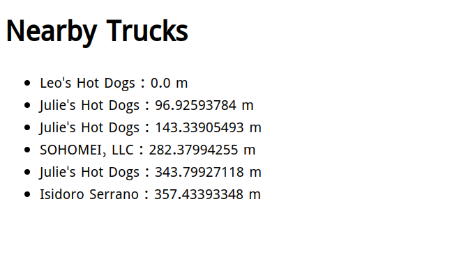

### Setup
**Run following commands**
* docker-compose up -d
* docker container exec -it foodtrucks__web python manage.py createsuperuser
* data file is loaded during migration

### Admin Url
* http://localhost:8000/admin/

### Available endpoints to use
* http://localhost:8000/
* After hitting this url you would see :

### Testing command
* docker container exec -it hex_images__web python manage.py test --settings=hex_images.settings.testing

### Code Coverage
* Need to write

### Time to finish
It took about 4 hours to finish the project

### TODO
* It was done in hurry in about 3-4 hours, just to achieve the main goal of the project, finding nearby trucks.
* Need to discuss about the data fields and then modify the Truck model and load data migration file.
* Put **Index** on model fields after discussing.

